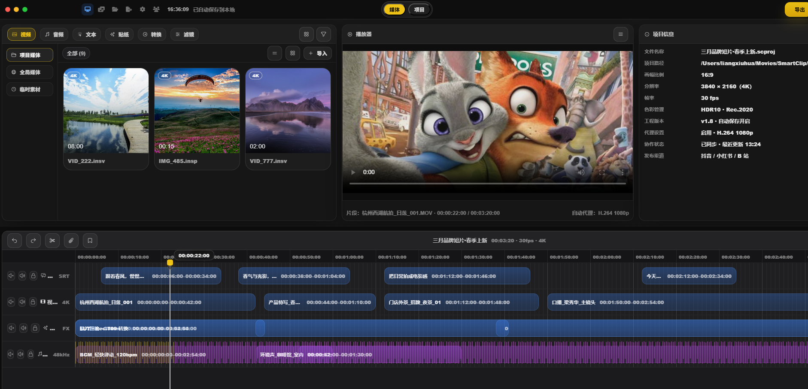
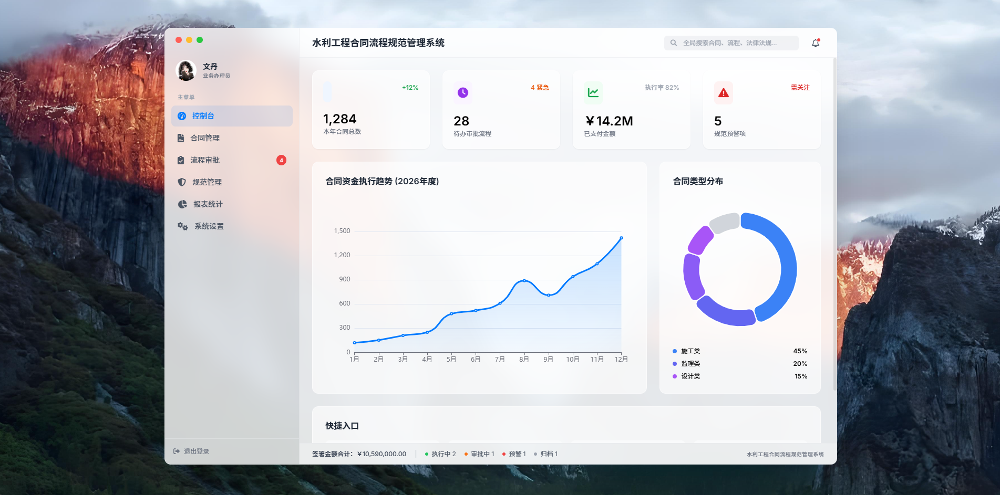

# Vibe Coding 页面作品集

[在线预览作品集](https://caixiang2005.github.io/vibe-coding-pages/)

个人 Vibe Coding 前端样式作品集，集中展示不同业务系统方向的页面视觉、信息布局和交互原型。项目以静态网页形式组织，根目录 `index.html` 作为统一入口，子页面作品集中存放在 `pages/` 目录中，便于通过 GitHub Pages 直接访问和展示。

## 项目内容

- 39 个前端样式作品与补充样例，覆盖后台管理、数据看板、业务系统原型等页面类型。
- 统一作品入口页，支持搜索、筛选、页面数量统计和截图样例标识。
- 原始页面目录集中归档在 `pages/` 中，保持作品内部资源引用稳定。
- README 保留项目说明、展示截图、在线入口和部署方式，适合作为 GitHub 仓库首页展示。

## 界面展示





## 目录结构

```text
.
├── index.html                # 统一作品入口页
├── README.md                 # GitHub 项目说明文档
├── assets/
│   ├── app.js                # 作品元数据、搜索与渲染逻辑
│   ├── styles.css            # 首页视觉样式
│   └── supplemental-samples/ # 补充截图样例
└── pages/                    # 原始页面作品目录
    ├── EX-BWLT.../
    └── NBZEX-BWLT.../
```

## 本地预览

直接打开根目录 `index.html`，或使用本地静态服务：

```bash
python -m http.server 8080
```

访问地址：

```text
http://localhost:8080/
```

## GitHub Pages 发布

1. 将项目提交到 GitHub 仓库。
2. 进入仓库 `Settings` -> `Pages`。
3. 在 `Build and deployment` 中选择 `Deploy from a branch`。
4. 选择 `main` 分支和 `/root` 目录。
5. 保存后等待部署完成，通过 GitHub Pages 地址访问作品集。
